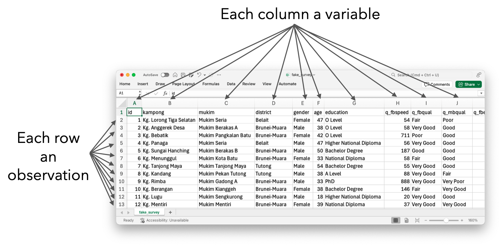

## Introduction

Who's who

## Introduction

::: {.columns}

::: {.column width=33%}

Datasaurus approves!

:::

::: {.column width=66%}

- **Automate End-to-End Survey Processing**  
  Write one script that pulls raw survey responses, cleans and validates fields and outputs ready-to-analyse datasets.

- **Standardise Analysis & Quality Checks**  
  Embed your business rules into reusable code so every round adheres to the same quality standards.

- **Generate Dynamic Reports in Seconds**  
  Turn your cleaned data into up-to-date charts, tables and written summaries automatically.

- **Quickly Prototype “What-If” Scenarios**  
  Simulate alternative weighting schemes, forecast adoption trends or run sensitivity analyses on key ICT indicators to guide policy adjustments.    

:::

:::

## The main game

<br>

{fig-align="center"}

::: aside
Source: [R for Data Science (2e)](https://r4ds.hadley.nz/)
:::

## Tidy data

{fig-align="center"}

::: aside
Source: `fake_survey.csv`
:::

## Tidy data (cont.)

> All happy families are alike; each unhappy family is unhappy in its own way. ---Leo Tolstoy

::: {.nudge-up-medium}
{fig-align="center" width=80%}
:::

::: aside
Source: [Allison Horst stats illustrations](https://github.com/allisonhorst/stats-illustrations)
:::

## Preamble

```{r}
#| label: setup
library(tidyverse)  # data wrangling tools
library(tinyplot)
library(tidytext)   # bigrams
library(tm)         # text mining
library(wordcloud)  # word clouds
library(gtsummary)
library(bruneimap)
tinytheme("clean2")

dat <- read_csv("fake_survey.csv")
glimpse(dat)
```


## Variability

Statistics is all about variability.

- Graph

## What is R?

What can we do using R?
Mainly used for statistical analysis.
Focus on data wrangling and data analysis.
Visualisations.
Create reproducible reports.

## General purpose programming language

Show for loops?


## There's a package for that


`{ellmer}`
`{rvest}`
`{bruneimap}`


## Getting started

- RStudio vs R [IDE vs language]
- Quick lay of the land
- RProj and "home" directory
- Mindset shift: Code everything!!! Reproducibility matters

## Statistical thinking

- Look at data, is it tidy?
- Clean?
- Objectives

## Importing data


## Data types

- Numeric (continuous vs integer)
- Logical
- Character
- Factors
- Ordered

## Summary statistics

### Continuous data 

```{r}
x <- dat$age
head(x)

# Mean and standard deviation
mean(x)
sd(x)

# Quick summary of the data
summary(x)
```

## Histograms

```{r}
#| out-width: 100%
#| fig-height: 5.2
tinyplot(x, type = "histogram", main = "Histogram of Age", xlab = "Age", 
         ylab = "Frequency")
```

## Density plots

```{r}
#| out-width: 100%
#| fig-height: 5.2
tinyplot(~ age | gender, data = dat, type = "density", main = "Age distribution", 
         xlab = "Age", fill = "by")
```


## Bar plots

```{r}
#| out-width: 100%
#| fig-height: 5.2
tinyplot(~ education, data = dat, type = "barplot")
```

## Bar charts (cont.) {.scrollable}

Need to clean up the data a bit. 

```{r}
unique(dat$education)
dat$education <- factor(dat$education, levels = c(
  "Lower Secondary", "O Level", "A Level", "National Certificate", "Diploma",
  "National Diploma", "Higher National Diploma", "Bachelor Degree",
  "Master Degree", "PhD"
))
tinyplot(~ education, data = dat, type = "barplot")
```

## Side-by-side bar charts {.scrollable}

<!-- 3. Quality of broadband internet access [bar chart side by side] -->

<!-- Excellent; V Good; Good; Fair; Poor; V Poor -->

<!-- MOBILE:    10, 28, 30, 34, 17, 4, 1 -->
<!-- BROADBAND: 10, 28, 34, 20, 6, 2 -->

```{r}
#| out-width: 100%
#| fig-height: 5.2
the_levels <- c("Poor", "Fair", "Good", "Very Good", "Excellent")
dat |>
  mutate(
    q_fbqual = factor(q_fbqual, levels = the_levels),
    q_mbqual = factor(q_mbqual, levels = the_levels)
  ) |>
  pivot_longer(c(q_fbqual, q_mbqual), names_to = "qual_type", 
               values_to = "quality") |>
  mutate(qual_type = recode(qual_type, q_fbqual = "Broadband", 
                            q_mbqual = "Mobile")) |>
  tinyplot(x = ~ quality | qual_type, type = "barplot", beside = TRUE)
```

## Scatter plots

```{r}
#| out-width: 100%

tinyplot(q_fbexpend ~ q_fbusage, data = dat, cex = 0.8,
         main = "Monthly expenditure vs data usage", 
         xlab = "Data usage (GB)", ylab = "Monthly expenditure (BND)")
tinyplot_add(type = "lm", col = "red3")
```

## Correlation 

```{r}
cor.test(dat$q_fbexpend, dat$q_fbusage)  # or just cor()
```

## (Simple) Linear regression model {.scrollable}

A simple linear regression model assumes
$$
\begin{gathered}
y = \beta_0 + \beta_1 x + \epsilon \\
\epsilon \sim N(0, \sigma^2)
\end{gathered}
$$

We can fit this model in R:

```{r}
fit <- lm(q_fbexpend ~ q_fbusage, data = dat)
summary(fit)
```


## Nice output for `lm()`

```{r}
fit <- lm(q_fbexpend ~ age + q_fbqual + q_fbusage, data = dat)
gtsummary::tbl_regression(
  fit,
  label = list(age ~ "Age", q_fbqual ~ "Broadband quality",
               q_fbusage ~ "Data usage")
) |>
  bold_labels() |>
  bold_p()
  
```

## Tables {.scrollable}

```{r}
dat |>
  select(gender, age, education, q_fbexpend, q_fbusage) |>
  tbl_summary(by = gender) |>
  add_overall() |>
  add_p()
```

## Spatial patterns


::: {.columns}

::: {.column width=50%}
```{r}
spend_mkm_df <-
  dat |>
  summarise(
    spend = mean(q_fbexpend), 
    .by = mukim
  )
print(spend_mkm_df)
```
:::

::: {.column width=50%}
```{r}
# From {bruneimap} package
glimpse(mkm_sf)
```

:::

:::


## Spatial patterns (cont.)

```{r}
left_join(mkm_sf, spend_mkm_df) |> # combines the two data frames
  ggplot() +
  geom_sf(aes(fill = spend)) +
  scale_fill_viridis_c(na.value = "white") +
  theme_minimal() 
```


## Word clouds

> (Comment section) Describe briefly the top reason that limits your internet access.
>  

```{r}
head(dat$q_limiting)
```

## Word clouds (cont.)

```{r}
#| echo: false
#| fig-align: center
#| out-width: 100%
corpus <- 
  Corpus(VectorSource(dat$q_limiting)) |>
  tm_map(content_transformer(tolower)) |>
  tm_map(removePunctuation) |>
  tm_map(removeNumbers) |>
  tm_map(removeWords, c(stopwords("en"), "just", "really", "get", "ive", "every")) |>
  tm_map(stripWhitespace)

# Stem words?
# corpus <- tm_map(corpus, stemDocument, language = "en")

tdm <- TermDocumentMatrix(corpus)
m <- as.matrix(tdm)
freq <- sort(rowSums(m), decreasing = TRUE)
word_freqs <- data.frame(word = names(freq), freq = freq)

set.seed(123)  # for reproducibility
wordcloud(
  words      = word_freqs$word,
  freq       = word_freqs$freq,
  min.freq   = 2,               # only words with freq >= 2
  max.words  = 100,             # draw up to 100 words
  random.order = FALSE,         # plot most frequent words in center
  colors     = RColorBrewer::brewer.pal(8, "Dark2")
)
```

## Bigrams

```{r}
#| echo: false
#| fig-align: center
#| out-width: 100%
bigram_counts <- 
  tibble(text = dat$q_limiting)  |>
  unnest_tokens(bigram, text, token = "ngrams", n = 2) |>
  separate(bigram, into = c("word1", "word2"), sep = " ") |>
  filter(!word1 %in% stop_words$word, !word2 %in% stop_words$word) |>
  unite(bigram, word1, word2, sep = " ") |>
  count(bigram, sort = TRUE) |>
  filter(!bigram %in% c("wi fi")) |>
  mutate(bigram = str_replace_all(bigram, "wi fi", "wifi"))

bigram_counts$n[2] <- bigram_counts$n[1] + bigram_counts$n[2]  # Adjust a bit
bigram_counts <- bigram_counts[-1, ]

# combine certain bigrams
for (big in c("internet plan", "video call")) {
  idx <- which(grepl(big, bigram_counts$bigram))
  bigram_counts$n[idx[1]] <- sum(bigram_counts$n[idx])
  bigram_counts <- bigram_counts[-idx[-1], ]
}

wordcloud(
  words        = bigram_counts$bigram,
  freq         = bigram_counts$n,
  min.freq     = 2,
  max.words    = 100,
  random.order = FALSE,
  colors       = brewer.pal(8, "Dark2")
)
```

