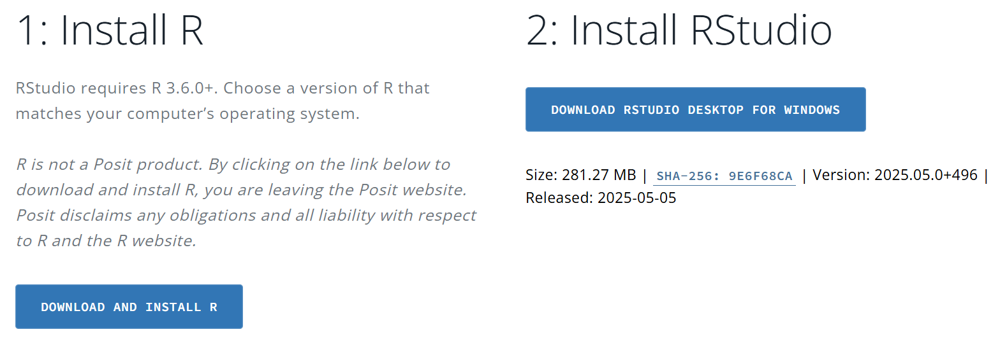
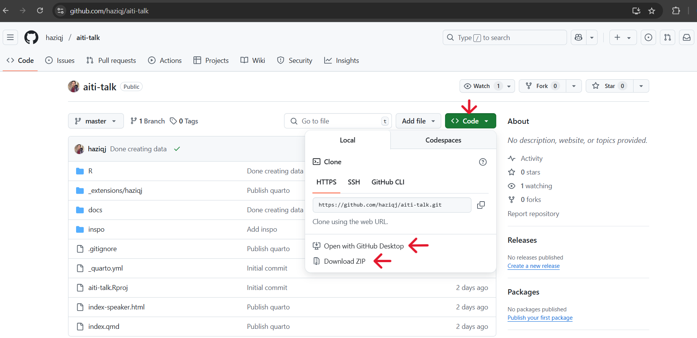

Welcome! Prior to attending the seminar talk, please ensure you have done the following.

# 1. Install R **and** RStudio

a. Download both software at <https://posit.co/download/rstudio-desktop/>. 

b. Once the download completes, double-click on the `.exe` file to run the installer. Simply follow the steps of the installer to finish.



**Note:** These are two different softwares, so please ensure you have installed both of them. For more detailed guideline, visit [link](https://teacherscollege.screenstepslive.com/a/1108074-install-r-and-rstudio-for-windows).

<br>

# 2. Download Workshop material
a. Visit <https://github.com/haziqj/aiti-talk> on your search engine. 

b. Press on the green `code` icon on top right.

c. Option 1: Open with Github Desktop and clone the repo onto a convenient location on your computer. <br>
   Option 2: Download the zip file and unzip onto a convenient location on your computer.
d. Click on `aiti-talk.Rproj` to open the project in RStudio.



<br>

# 3. ⁠Install all packages

a. Launch Rstudio app directly. It will look something like:

](panes.png)

**Note:** Previously, we installed both R (language) and Rstudio (IDE). However, all coding can be done in just Rstudio. 

<br>

b. Install the following R packages by running the following code in the `console` pane:

```{r}
#| eval: false
#| code-fold: false
install.packages(c(
  "tidyverse", 
  "tinyplot",
  "bruneimap"
))
```

<br>

# 4. Ready to start! 🥳
Quick Tips

- To work on long chunks of codes, it is recommended to use the `source` pane by creating a R Script.

- To create a R Script: **File > New File > R Script**

- To run code: press `Ctrl + Enter` (Windows) or `Cmd + Enter` (Mac). Alternatively, press `run` icon (top right) of the `source` pane.

- To load libraries for additional functions, run the codes in `source` pane:
```{r}
#| eval: false
#| code-fold: false
library(tidyverse)
library(ggplot2)
```

<br>

# Try it out!
```{r}
print("Hello, World!")
```

```{r}
plot(pressure)
```

From simple printing to complex visualisation, possibilities are now limitless, Happy coding!


