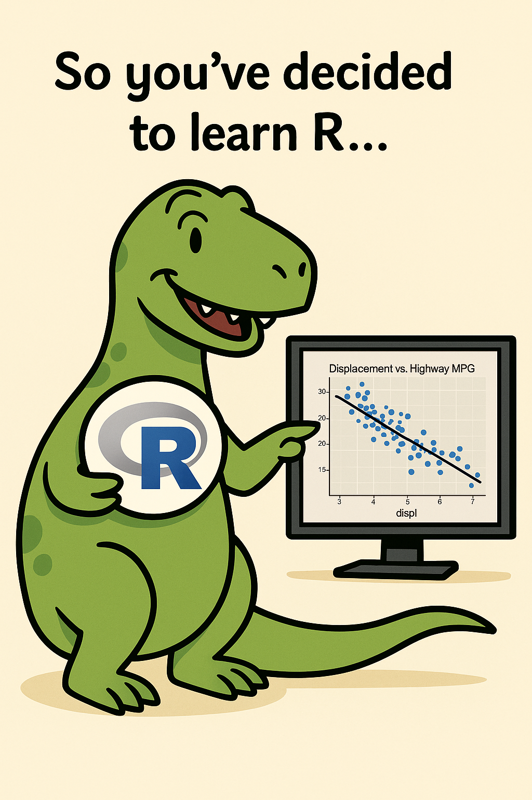
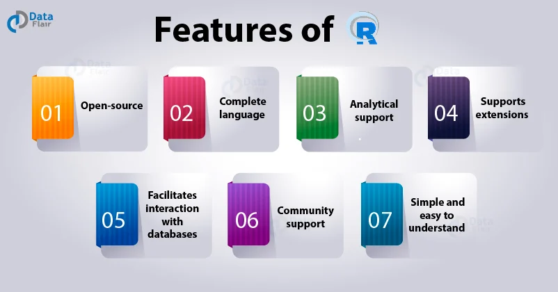
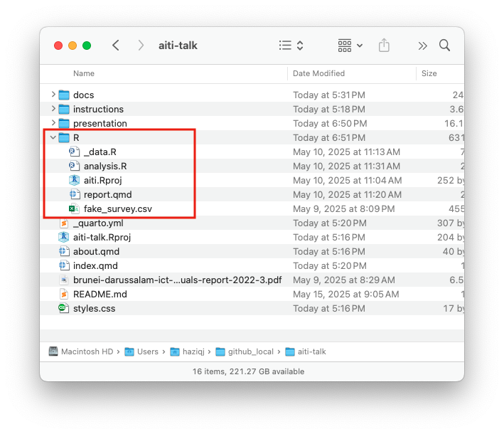
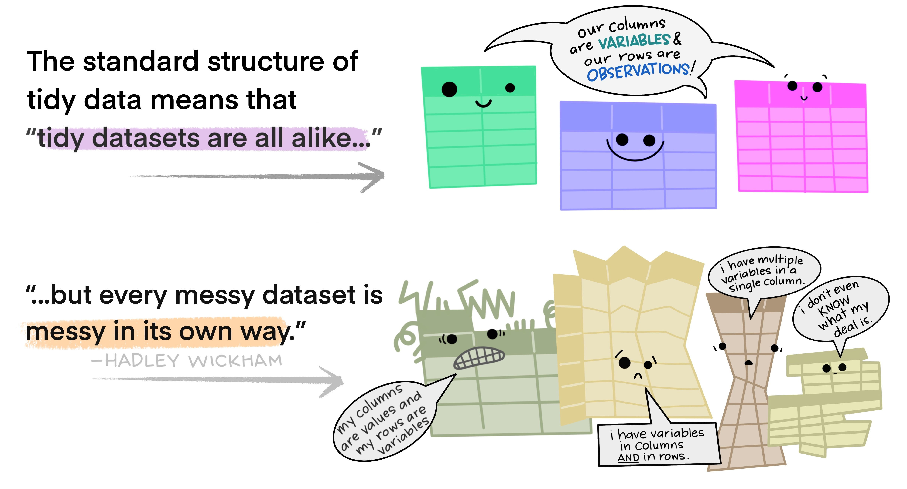
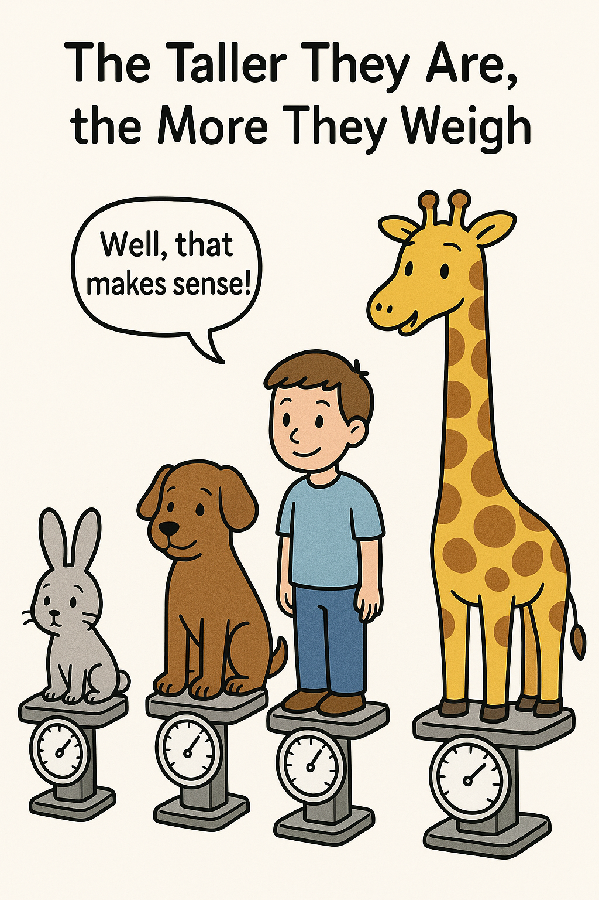
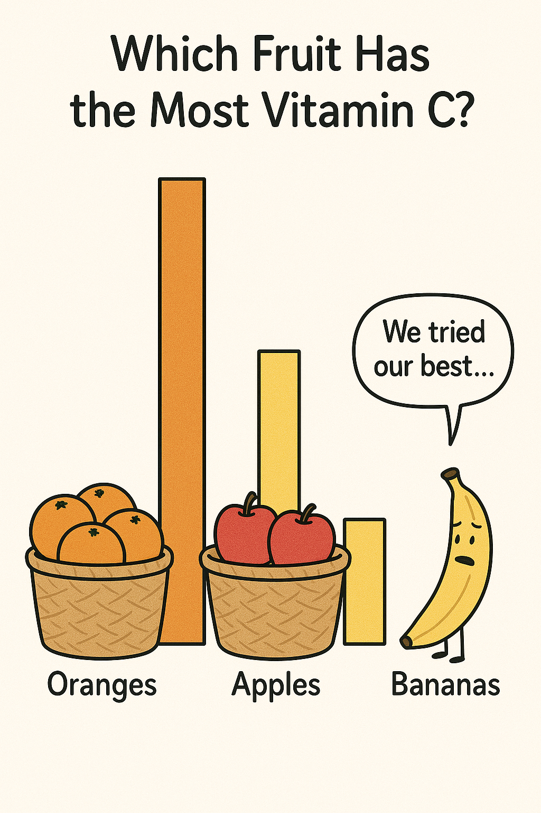
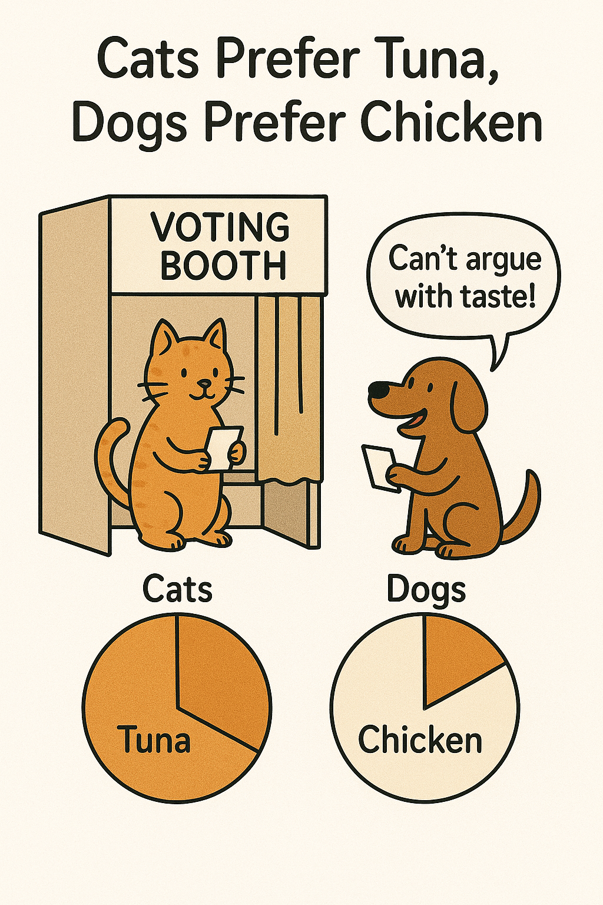

## Introduction

Who's who

## Introduction

::: {.columns}

::: {.column width=33%}

Datasaurus approves!

:::

::: {.column width=66%}

- **Automate End-to-End Survey Processing**  
  Write one script that pulls raw survey responses, cleans and validates fields and outputs ready-to-analyse datasets.

- **Standardise Analysis & Quality Checks**  
  Embed your business rules into reusable code so every round adheres to the same quality standards.

- **Generate Dynamic Reports in Seconds**  
  Turn your cleaned data into up-to-date charts, tables and written summaries automatically.

- **Quickly Prototype “What-If” Scenarios**  
  Simulate alternative weighting schemes, forecast adoption trends or run sensitivity analyses on key ICT indicators to guide policy adjustments.    

:::

:::

## The main game

<br>

{fig-align="center"}

::: aside
Source: [R for Data Science (2e)](https://r4ds.hadley.nz/)
:::

## Why choose R?

R is an interpreted programming language for statistical computing and data visualisation. It has been adopted in many fields, especially statistics and data science.

{fig-align="center"}


::: aside
Source: [Data Flair](https://data-flair.training/blogs/using-r-for-data-science/)
:::

## R and RStudio

- You can run R in the terminal, the R GUI, or other apps like RStudio.
- RStudio is an IDE (integrated development environment) for R. 
- Alternatives include VSCode, Emacs, and `<insert favourite IDE>`.

. . . 

```{r}
my_string <- "Hello, World!"
print(my_string)

# Create a vector, manipulate it
x <- c(1, 2, 3, 4, 5)
sum(x) / length(x)
for (i in x) print(i)
```


## Lay of the land

### Project folder


::: {.columns}
::: {.column width=50%}
1. Download material from <https://github.com/haziqj/aiti-talk>
2. Choose a location to save the project
3. Go to the R/ folder, and open the `aiti.RProj` file
4. This will open a new **RStudio project**

::: {.callout-tip}
### Project folder

R needs to know where is your project's "home" directory.
By clicking on the RProj file, RStudio will set the working directory to the project folder.


:::


:::
::: {.column width=50%}

::: {.nudge-up}
::: {.nudge-up-large}
```{r}
#| out-width: 50%
#| fig-align: center
#| echo: false

```
:::
:::
::: {.nudge-up-large}
::: {.nudge-up-xl}
```{r}
#| out-width: 90%
#| fig-align: center
#| echo: false

```
:::
:::
:::
:::

## Lay of the land

### RStudio

{fig-align="center" width=65%}

## Preamble

```{r}
#| label: setup
library(tidyverse)  # data wrangling tools
library(tinyplot)   # for quick plotting
library(tidytext)   # bigrams
library(tm)         # text mining
library(wordcloud)  # word clouds
library(gtsummary)  # pretty summary tables
library(bruneimap)  # for mapping

theme_set(theme_bw())  # ggplot2
tinytheme("clean2")    # tinyplot
```

::: {.callout-tip}
### Installing packages

In RStudio, if a package is not installed, a yellow ribbon will appear prompting you to install it.
You can also manually install packages by running:
```r
install.packages("<package name>")  # only need to install once
library("<package name>")           # but load the package every time!
```
Or browse the 'Packages' pane in RStudio.
:::

## Importing data

```{r}
#| eval: false
dat <- read_csv("fake_survey.csv")
glimpse(dat)
```

```{r}
#| echo: false
dat <- read_csv("../R/fake_survey.csv")
glimpse(dat)
```

::: {.callout-tip}
### Demographic vs study questions
Usually, a survey contains two types of question: 1) Demographic, and 2) study questions.
:::

## Data types

```{mermaid}
%%| echo: false
%%| fig-align: center
graph TD
    A[**Data Type**]
    
    A --> B["**Logical**<br><br>e.g. TRUE, FALSE"]
    A --> C[**Numeric**]
    A --> D["**Complex**<br><br>e.g. 1+2i, 3+4i"]
    A --> E["**Character**<br><br>e.g. 'cat', 'blue'"]
    
    C --> CA["**Integer**<br><br>e.g. 1L, 314L"]
    C --> CB["**Double**<br><br>e.g. 1.23, 3.141"]
    
    E --> EA["**Factor**<br><br>e.g. 'MOE', 'MTIC', 'MOH'"]
    E --> EB["**Ordered**<br><br>e.g. 'Disagree', 'Neutral',<br>'Agree'"]
    
    %% Assign nodes to classes
    class EA pink
    class EB pink

    %% Define styles for the classes
    classDef pink fill:#f9c,color:#fff,stroke:#333,stroke-width:1px
```

::: {.callout-tip}
### Know your data types
We must know the data types of our variables to perform the correct operations on them. For example, if we want to calculate the mean of a variable, it must be numeric. If it is a factor/ordered, we need to convert it to numeric first.
:::

## Transforming data {.scrollable}

::: {.nudge-down}

```{r}
#| output-location: slide
dat <-
  dat |>
  mutate(
    # Convert education to factors
    education = factor(education, levels = c(
      "Lower Secondary", "O Level", "A Level", "National Certificate", "Diploma",
      "National Diploma", "Higher National Diploma", "Bachelor Degree",
      "Master Degree", "PhD"
    )),
    # Convert Likert scale to ordered factors
    across(c(q_mbqual, q_fbqual), function(x) ordered(x, levels = c(
      "Very Poor", "Poor", "Fair", "Good", "Very Good", "Excellent"
    )))
  )

glimpse(dat)
head(as.numeric(dat$q_mbqual), 15)
head(as.numeric(dat$kampong), 15)
```
:::


## Tidy data

{fig-align="center"}

::: aside
Source: `fake_survey.csv`
:::

## Tidy data (cont.)

> All happy families are alike; each unhappy family is unhappy in its own way. ---Leo Tolstoy

::: {.nudge-up}
{fig-align="center" width=83%}
:::

::: aside
Source: [Allison Horst stats illustrations](https://github.com/allisonhorst/stats-illustrations)
:::

## Mindset shift & expectations

Code everything!!! Reproducibility matters


# Start

## Variability

At its core, statistics is the **science of understanding _variability_**.

```{r}
#| echo: false
#| out-width: 100%
#| fig-height: 3
N <- 200
bind_rows(
  tibble(x = scales::rescale(rbeta(N, 5, 2), c(1, 5)), case = "Variability present"),
  tibble(x = rep(3, N), case = "No variability")
) |>
  ggplot(aes(x, y = 1)) +
  geom_violin(fill = "red3", alpha = 0.15, col = NA) +
  geom_jitter(height = 0.03, width = 0, alpha = 0.5) +
  facet_grid(case ~ .) +
  theme_bw() +
  theme(
    axis.ticks.y = element_blank(),
    axis.text.y = element_blank(),
    axis.title.y = element_blank()
  ) +
  coord_cartesian(ylim = c(0.5, 1.5), xlim = c(1, 5)) +
  labs(title = "How satisfied are you with the quality of your fixed broadband connection?",
       x = NULL) 
```

- No variability = no insight.
- Segmentation, patterns or predictors of dissatisfaction.
- Inform policy decisions.

## Summary statistics

### Continuous data 

```{r}
x <- dat$age
head(x)

# Mean and standard deviation
mean(x)
sd(x)

# Quick summary of the data
summary(x)
```

## Boxplots

```{r}
#| out-width: 100%
#| fig-height: 5.2
boxplot(x, horizontal = TRUE, main = "Boxplot of Age", ylab = "Age", 
        col = "lightblue")
```


## Histograms 

```{r}
#| out-width: 100%
#| fig-height: 5.2
hist(x, main = "Histogram of Age", xlab = "Age", ylab = "Frequency", 
     col = "lightblue", breaks = 10)
```

## Histograms and density plots

```{r}
#| out-width: 100%
#| fig-height: 5
hist(x, main = "Histogram of Age with density overlaid", xlab = "Age", 
     ylab = "Density", col = "lightblue", breaks = 10, prob = TRUE)
lines(density(x), lwd = 3, col = "red3")
```


<!-- tinyplot(x, type = "histogram", main = "Histogram of Age", xlab = "Age",  -->
<!--          ylab = "Frequency") -->


<!-- ## Density plots -->

<!-- ```{r} -->
<!-- #| out-width: 100% -->
<!-- #| fig-height: 5.2 -->
<!-- tinyplot(~ age | gender, data = dat, type = "density", main = "Age distribution",  -->
<!--          xlab = "Age", fill = "by") -->
<!-- ``` -->

## Summary statistics {.scrollable}

### Nominal (discrete) data 

```{r}
x <- dat$gender
head(x)

# No such thing as the 'mean' of character vectors!
mean(x)

# Instead, do this:
table(x)
prop.table(table(x))

# If you're fancy:
chisq.test(table(x))
```

## Bar plots

```{r}
#| out-width: 100%
#| fig-height: 5.2
x <- dat$education
barplot(table(x), las = 2, cex.names = 0.8, main = "Barplot of Education", 
        ylab = "Frequency", col = "lightblue")
```

## Co-variability

::: {.columns}
::: {.column width=33%}
#### Continuous vs continuous

{fig-align="center" width=90%}


:::
::: {.column width=33%}
#### Continuous vs nominal

{fig-align="center" width=90%}


:::
::: {.column width=33%}
#### Nominal vs nominal

{fig-align="center" width=90%}

:::
:::


::: aside
Source: ChatGPT (gpt-4o)
:::

<!-- - Continuous vs continuous -->
<!-- - Continuous vs nominal -->
<!-- - Nominal vs nominal -->

<!-- ```{r} -->

<!-- ``` -->


## Side-by-side bar charts {.scrollable}

<!-- 3. Quality of broadband internet access [bar chart side by side] -->

<!-- Excellent; V Good; Good; Fair; Poor; V Poor -->

<!-- MOBILE:    10, 28, 30, 34, 17, 4, 1 -->
<!-- BROADBAND: 10, 28, 34, 20, 6, 2 -->

```{r}
#| out-width: 100%
#| fig-height: 5.2
the_levels <- c("Poor", "Fair", "Good", "Very Good", "Excellent")
dat |>
  mutate(
    q_fbqual = factor(q_fbqual, levels = the_levels),
    q_mbqual = factor(q_mbqual, levels = the_levels)
  ) |>
  pivot_longer(c(q_fbqual, q_mbqual), names_to = "qual_type", 
               values_to = "quality") |>
  mutate(qual_type = recode(qual_type, q_fbqual = "Broadband", 
                            q_mbqual = "Mobile")) |>
  tinyplot(x = ~ quality | qual_type, type = "barplot", beside = TRUE)
```

## Scatter plots

```{r}
#| out-width: 100%

tinyplot(q_fbexpend ~ q_fbusage, data = dat, cex = 0.8,
         main = "Monthly expenditure vs data usage", 
         xlab = "Data usage (GB)", ylab = "Monthly expenditure (BND)")
tinyplot_add(type = "lm", col = "red3")
```

## Correlation 

```{r}
cor.test(dat$q_fbexpend, dat$q_fbusage)  # or just cor()
```

## (Simple) Linear regression model {.scrollable}

A simple linear regression model assumes
$$
\begin{gathered}
y = \beta_0 + \beta_1 x + \epsilon \\
\epsilon \sim N(0, \sigma^2)
\end{gathered}
$$

We can fit this model in R:

```{r}
fit <- lm(q_fbexpend ~ q_fbusage, data = dat)
summary(fit)
```


## Nice output for `lm()`

```{r}
fit <- lm(q_fbexpend ~ age + q_fbqual + q_fbusage, data = dat)
gtsummary::tbl_regression(
  fit,
  label = list(age ~ "Age", q_fbqual ~ "Broadband quality",
               q_fbusage ~ "Data usage")
) |>
  bold_labels() |>
  bold_p()
  
```

## Tables {.scrollable}

```{r}
dat |>
  select(gender, age, education, q_fbexpend, q_fbusage) |>
  tbl_summary(by = gender) |>
  add_overall() |>
  add_p()
```

## Spatial patterns


::: {.columns}

::: {.column width=50%}
```{r}
spend_mkm_df <-
  dat |>
  summarise(
    spend = mean(q_fbexpend), 
    .by = mukim
  )
print(spend_mkm_df)
```
:::

::: {.column width=50%}
```{r}
# From {bruneimap} package
glimpse(mkm_sf)
```

:::

:::


## Spatial patterns (cont.)

```{r}
left_join(mkm_sf, spend_mkm_df) |> # combines the two data frames
  ggplot() +
  geom_sf(aes(fill = spend)) +
  scale_fill_viridis_c(na.value = "white") +
  theme_minimal() 
```


## Word clouds

> (Comment section) Describe briefly the top reason that limits your internet access.
>  

```{r}
head(dat$q_limiting)
```

## Word clouds (cont.)

```{r}
#| echo: false
#| fig-align: center
#| out-width: 100%
corpus <- 
  Corpus(VectorSource(dat$q_limiting)) |>
  tm_map(content_transformer(tolower)) |>
  tm_map(removePunctuation) |>
  tm_map(removeNumbers) |>
  tm_map(removeWords, c(stopwords("en"), "just", "really", "get", "ive", "every")) |>
  tm_map(stripWhitespace)

# Stem words?
# corpus <- tm_map(corpus, stemDocument, language = "en")

tdm <- TermDocumentMatrix(corpus)
m <- as.matrix(tdm)
freq <- sort(rowSums(m), decreasing = TRUE)
word_freqs <- data.frame(word = names(freq), freq = freq)

set.seed(123)  # for reproducibility
wordcloud(
  words      = word_freqs$word,
  freq       = word_freqs$freq,
  min.freq   = 2,               # only words with freq >= 2
  max.words  = 100,             # draw up to 100 words
  random.order = FALSE,         # plot most frequent words in center
  colors     = RColorBrewer::brewer.pal(8, "Dark2")
)
```

## Bigrams

```{r}
#| echo: false
#| fig-align: center
#| out-width: 100%
bigram_counts <- 
  tibble(text = dat$q_limiting)  |>
  unnest_tokens(bigram, text, token = "ngrams", n = 2) |>
  separate(bigram, into = c("word1", "word2"), sep = " ") |>
  filter(!word1 %in% stop_words$word, !word2 %in% stop_words$word) |>
  unite(bigram, word1, word2, sep = " ") |>
  count(bigram, sort = TRUE) |>
  filter(!bigram %in% c("wi fi")) |>
  mutate(bigram = str_replace_all(bigram, "wi fi", "wifi"))

bigram_counts$n[2] <- bigram_counts$n[1] + bigram_counts$n[2]  # Adjust a bit
bigram_counts <- bigram_counts[-1, ]

# combine certain bigrams
for (big in c("internet plan", "video call")) {
  idx <- which(grepl(big, bigram_counts$bigram))
  bigram_counts$n[idx[1]] <- sum(bigram_counts$n[idx])
  bigram_counts <- bigram_counts[-idx[-1], ]
}

wordcloud(
  words        = bigram_counts$bigram,
  freq         = bigram_counts$n,
  min.freq     = 2,
  max.words    = 100,
  random.order = FALSE,
  colors       = brewer.pal(8, "Dark2")
)
```

